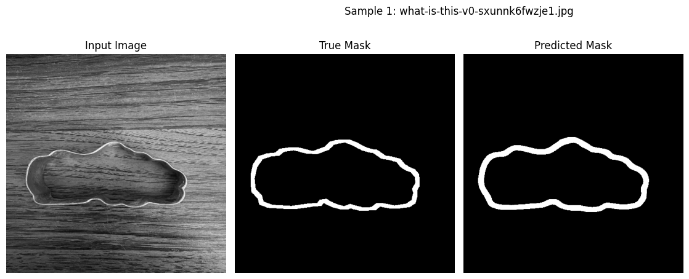
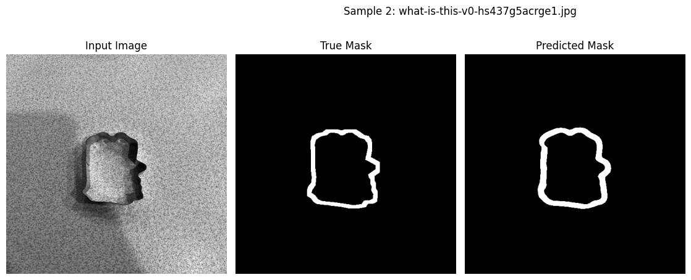

# Cookie cutter search

## The problem

There is a subreddit I love called [r/whatismycookiecutter](https://www.reddit.com/r/whatismycookiecutter/). I love the creativity of the responses. I was wondering if there's a way to see if a cutter has already been seen by this subreddit. How would one go about extracting the profile of a cutter from an image and comparing it with a database of cutters.

I started with a basic contour approach but the images all have different backgrounds, angles and lighting which makes this approach impossible. So I switched to training a model in PyTorch. I have annotated over 200 images of cookie cutters. Here are some outputs:

The current secret source is a loss function that priorities smooth lines and closed loops. The network is based off of [this model](https://github.com/aladdinpersson/Machine-Learning-Collection/blob/master/ML/Pytorch/image_segmentation/semantic_segmentation_unet/train.py).

The dataset is only trained on single metal cutters.

## Thinking

- Is it possible to correct for the camera angle by weighting the amount of the band seen on either side of the cutter.
- How am I going to store the cutters as a vector
- How can I compare these vectors irrespective of the cutters orientation or angle
  - cv2.moments() ???
  - cv2.HuMoments(moments).flatten() ????
